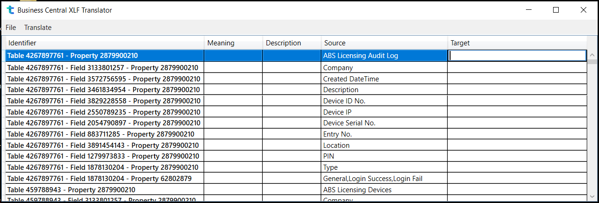
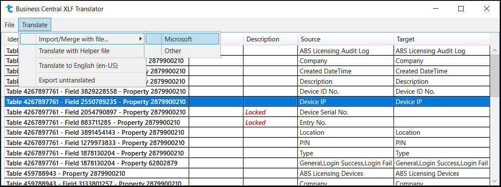
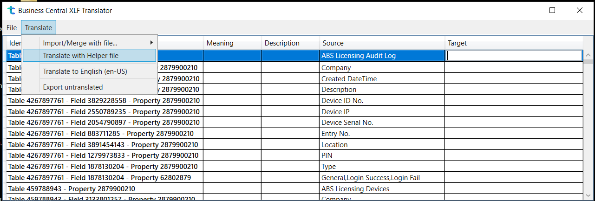
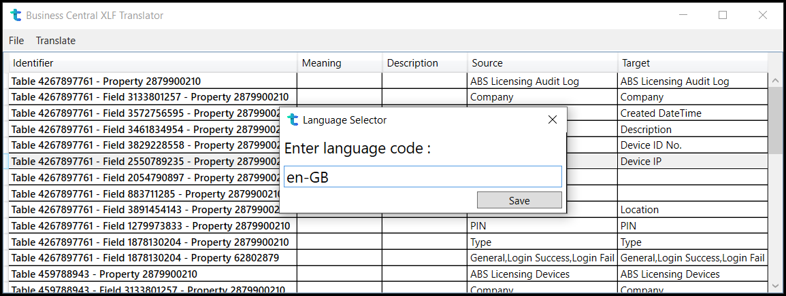

# Business Central XLF Translator

An XLF editor with merge/import/translate feature.

I have taken base parser and UI elements from an open source Project, where owner has designed it for his angular projects (Kudos to DavidOndrus).

Since i was facing a similar issue with Business central and my translation vendor was not able to tackle those issues.

So i redesigned the logic to make it useful for me.

Now this tool is capable of :

1 : Generating BC supported XLFs

2 : Reuse translation from already translated XLF.

3 : Ignore/lock strings which do not need translation as per MS.

4 : Translating strings to en-US within the tool.

5 : For handling large XLFs, it shows progress of left work.

6 : Provide functionality of Save/Save As for XLFs.

7 : While saving XLFs you can specify Target language code.

8 : It can grab all the untranslated strings (if you want them to get translated from third-party) with export functionality.

## Images






## Output
SOURCE:
```XML
<?xml version="1.0" encoding="UTF-8" ?>
<xliff version="1.2" xmlns="urn:oasis:names:tc:xliff:document:1.2">
  <file source-language="en" datatype="plaintext" original="ng2.template">
    <body>
      <trans-unit id="loginHeaderTitle" datatype="html">
        <source>Login</source>
        <target>Login</target>
        <context-group purpose="location">
          <context context-type="sourcefile">app/login/login.component.ts</context>
          <context context-type="linenumber">7</context>
        </context-group>
        <note priority="1" from="description">description</note>
        <note priority="1" from="meaning">meaning</note>
      </trans-unit>
    </body>
  </file>
</xliff>
```
RESULT:
```XML
<?xml version="1.0" encoding="UTF-8"?>
<xliff version="1.2" xmlns="urn:oasis:names:tc:xliff:document:1.2">
  <file source-language="en">
    <body>
      <trans-unit id="loginHeaderTitle">
        <source>Login</source>
        <target>Login</target>
        <note from="description">description</note>
        <note from="meaning">meaning</note>
      </trans-unit>
    </body>
  </file>
</xliff>
```
